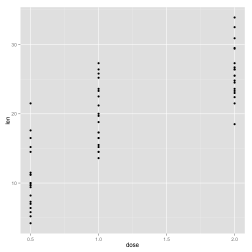
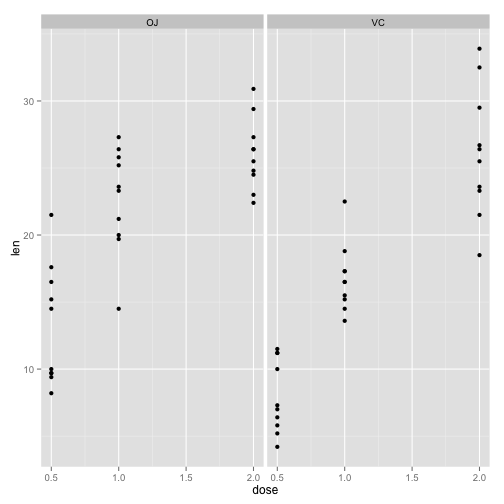
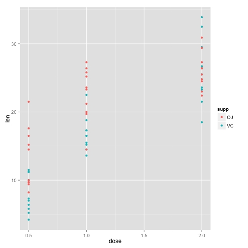

Statistical Inference Project Part B
========================================================

This is the second part of the Statistical Inference´s course project.  
In this project the data set about the tooth growth in guinea pigs is analyzed. 

### Loading the ToothGrowth data

```r

data(ToothGrowth)
library(ggplot2)
```

### Exploratory data analysis

Basically the data set contains 3 variables and 60 observations about the tooth growth in guinea pigs.
The variables are  len(the tooth length), supp  (the type of supplement VC or OJ) and dose (the dose in milligrams)


```r

head(ToothGrowth)
```

```
##    len supp dose
## 1  4.2   VC  0.5
## 2 11.5   VC  0.5
## 3  7.3   VC  0.5
## 4  5.8   VC  0.5
## 5  6.4   VC  0.5
## 6 10.0   VC  0.5
```

```r
summary(ToothGrowth)
```

```
##       len       supp         dose     
##  Min.   : 4.2   OJ:30   Min.   :0.50  
##  1st Qu.:13.1   VC:30   1st Qu.:0.50  
##  Median :19.2           Median :1.00  
##  Mean   :18.8           Mean   :1.17  
##  3rd Qu.:25.3           3rd Qu.:2.00  
##  Max.   :33.9           Max.   :2.00
```

When observing the len vs the dose variables, it can be observed three well defined groups: 
those which received 0.5 mg dose, 1mg dose or 2mg dose

```r
qplot(dose, len, data = ToothGrowth)
```

 

Combining the supplement with the previous data, XXXXXX

```r
qplot(dose, len, data = ToothGrowth, facets = . ~ supp)
```

 


```r
qplot(dose, len, data = ToothGrowth, color = supp)
```

 


### Confidence Intervals and hypothesis tests to compare tooth growth by supp and dose
 
### Conclusions and assumptions needed for your conclusions
 
